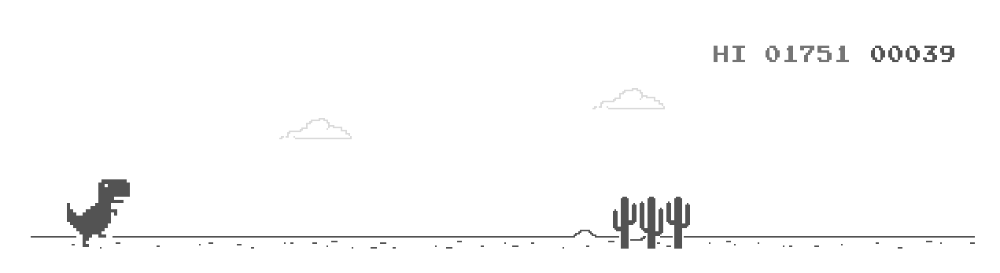
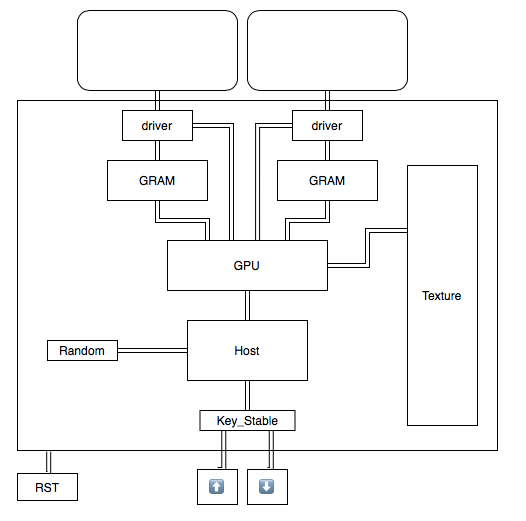

# FDE-Rex-Runner

复旦大学2020年研究生课程《系统可编程芯片设计》<br>
小组成员：<br>
张朕银20212020089<br>
薛玥20212020163<br>
郭家兴20212020180<br>
张盼20212020094<br>
万欣然20212020049<br>

------

# 项目介绍

项目计划使用FDE3P7开发板，实现一个Google Chrome浏览器在404页面的小恐龙跑酷游戏。<br>


项目涉及的软件：<br>
- FDE2019
- Design Compiler
- SMIMS
  - VeriInstrument
  - HDLAutoDesign
  - (软件包中的其他软件暂不使用)
- Quartus（仅用于设计验证）
- Vivado（仅用于设计验证）

项目计划时间：<br>
从10月19日起，至11月2日止，计划做出一份可玩的发布版本。后续直至课程DDL（11月9日），用来优化设计。

------

# Top Design



使用两块LCD_Graphic设备拼接成一块长屏幕。<br>
Driver：负责将GRAM中的像素依次给入LCD_Graphic；<br>
GRAM：存储屏幕中需要显示的所有像素<br>
GPU：负责处理图像数据，将Texture中的信息综合处理，写入到GRAM中，并发信号让driver开始给入<br>
Host：负责主要的游戏逻辑<br>
Random：负责生成随机数<br>
Key_Stable：按键防抖动<br>
Texture：存储原图，以供GPU进行处理<br>
另有时钟分频模块未显示<br>

------
# Module Design

Host游戏逻辑模块内部，计划设计一套指令集来实现。<br>
Host和GPU之间的交互也需要设计一套指令。<br>
上述指令集无需很复杂，也无需很通用，只要能够清晰地实现本设计的特定功能即可。<br>
GPU内部还应设计一定的存储层次和执行层次。具体可参考NVIDIA公司的CUDA编程模型。

------
## Host与GPU之间的接口

Host发送给GPU的信号旨在告知GPU，将存储在Texture中```addr```处、大小为```width x height```的图片的```左下角```，放置在屏幕的```(x,y)```位置```(以屏幕左下角为(0,0))```。<br>
由于Texture的地址位宽设计成16位（见下文），图片大小```width x height```考虑为```(1~256)x(1~64)```
<br>
注意到图片的宽和高为零没有意义，因此用数值n表示宽度n+1像素或高度n+1像素以节省位宽。例如```(127,63)```表示```128px x 64px```（px: pixel, 像素）<br>
由于游戏有时需要将贴图的一部分显示出来，坐标```(x,y)```需要有负数范围，以便将图像的左下角定位在屏幕之外，从而显示贴图的一部分。上文已经设定了width、height的范围，因此坐标```(x,y)```的范围考虑为```((-256~255),(-64~63))```。可使用有符号整型```int```的设计。<br>

由此，端口宽度不妨设计成：<br>
master: (output en, output [47:0]content)
```
(        16         )(    8    )(   2+6   )(     9     )(   7    )
[xxxx_xxxx_xxxx_xxxx][xxxx_xxxx][00xx_xxxx][xxxx_xxxx_x][xxxx_xxx]
[  addr in Texture  ][  width  ][ height  ][     x     ][   y    ]
```
当clock上升沿且en为1时，将content写入slave。写入完后，通常要将en置为0，以避免重复的数据写入。<br>
本质上是给Host开放一个写入GPU的任务空间的端口。<br>
注意到这种端口并非指定地址式的写入端口(clk,addr,q,wr)，而是队列式的(clk,content)。<br>
之所以content设计为48位，是为了能够更方便地在Host中作出处理。详见Host指令集设计。

注意，Host和GPU接受的时钟周期必须频率一致，否则可能GPU会接收到重复的指令。

----
## Host存储框架

存储资源一览
- 运算寄存器A,B
- 一般寄存器r1～r7
- 读写空间0x00~0xFF（共256byte）<br>其中有些地址是有特殊含义的
- 程序指针PC（不可显式配置）
- 程序栈（不可显式配置）
- 调用栈指针SP（不可显式配置）
- 调用栈（不可显式配置）

具有特殊含义的读写空间
|地址|特殊意义|详细解释|
|-|-|-|
|0x00|timer_low|定时器低8位|
|0x01|timer_high|定时器高8位|
|0x02|timer_ceiling_low|定时器上限低8位|
|0x03|timer_ceiling_high|定时器上限高8位|
|0x04|timer_state|定时器功能状态寄存器<br>[0]:是否计时<br>[1]:0:循环计时;1:单次计时<br>[2]:是否触发程序跳转<br>[7:3]:未使用|
|0x05|gpu_port[7:0]|GPU交互端口的[7:0]位|
|0x06|gpu_port[15:8]|GPU交互端口的[15:8]位|
|0x07|gpu_port[23:16]|GPU交互端口的[23:16]位|
|0x08|gpu_port[31:24]|GPU交互端口的[31:24]位|
|0x09|gpu_port_state|主要是en信号|
|0x0a|key_0_counter|按键0的已按下时间|
|0x0b|key_1_counter|按键1的已按下时间|
|0x0c~0xff||无特殊含义|
$\color{red}【注意】$设计时需要考虑到timer_low, timer_high, key_0_counter, key_1_counter的写权限问题，处理的不好容易产生驱动信号冲突。

------
## Host指令集

只做一般的指令集，不计划做任何流水线设计，否则项目进度可能因此耽误。

指令集宽度定为16，操作数位宽为8-bit（即1byte）。

指令表
|机器码|汇编代码|含义|
|-|-|-|
|0000_0000_0000_0000|NOP|什么也不做，等待一个周期|
||MOV A,0x00|将0x00处的数据移到A中|
||MOV 0x00,A|将A中的数据移到0x00处|
||MOV Rn,0x01|将0x01处的数据移到Rn中<br>（0 $\le n \lt 8$，下同）|
||MOV 0x01,Rn|将Rn中的数据移到0x01处|
||MOV A,Rn|将Rn中的数据移到A中（B也可）|
||MOV Rn,A|将A中的数据移到Rn中（B也可）|
||MOV A,B|将B中的数据转移到A中|
||MOV B,A|将A中的数据转移到B中|
||ADD|{B,A}=A+B<br>将A+B的和存储在A中，进位信息存储在B中<br>也可以认为A+B是一个9-bit的数，低8位存储在A中，高1位存储在B中。|
||SUB|{B,A}=A-B<br>将A-B的差存储在A中，借位信息存储在B中（如果借位则是负数）|
||MUL|{B,A}=A\*B<br>将A\*B的结果低8位存储在A中，高8位存储在B中|
||DIV|{B,A}=A/B<br>将A/B的商存储在A中，余数存储在B中<br>$\color{red}{如果不好做可以不做这个功能}$|
||SHL|A和B循环左移（B的最高位移到A的最低位）|
||SHR|A和B循环右移（A的最低位移到B的最高位）|
||JMP 0x74|无条件跳转到0x74处。实际的机器码由编译器计算|
||BJMP 0x74|如果B不为零，则跳转到0x74处。|
||BZJMP 0x74|如果B为零，则跳转到0x74处。|
||CALL 0x88|调用0x88处的子程序，SP+=1，并将PC+1压入调用栈中|
||RET|子程序返回，SP-=1，PC=调用栈顶的内容|

<font color="#FF0000">注：可能需要查加法器、乘法器的组合逻辑实现，而非直接使用verilog中的'+','*'的操作符</font>

Host内部设有一个程序指针，名为PC，指向当前指令在指令栈中的地址。如果当前指令是分支跳转指令，则跳转到相应地址，否则PC+=1。

<font color="skyblue">之所以做这个稍微有点复杂的处理器，是为了后面DE-SoC实验能够复用</font>

------

## 编译器

需要设计一个适用于Host及其指令集的汇编代码“编译器”。具体可使用python制作一个文字处理软件，将汇编代码文件（文本格式）按照指令表翻译成机器码，然后转录成Host中存储命令的RAM模块（或是生成.mif文件）。

<font color="red">注：写程序的时候可以手撕机器码，不着急做编译器。</font>

------
## GPU内部设计

GPU接收到Host发来的信息后，将其存储在缓冲队列中，并自行获取并执行。这需要两个指针和一个缓冲区来完成。<br>
记缓冲区为Buffer。Buffer接受两个时钟，一个来自master，另一个来自slave。

<font color="red">注：此处双时钟设计可能会冲突报错。先进行Buffer的双时钟设计以确保此设计可行。</font>

------
## Texture的存储方式与大小

Texture设计成位宽为8-bit的存储空间。<br>
每块LCD_Graphic显示器的尺寸为64x128，黑白像素，因而需要存储的信息长度就为8192bit，即1024byte。<br>
之前测得FDE板载资源上限大约为12张LCD_Graphic当量。两块GRAM会消耗两块当量的资源，那么假使Texture中要存储6张LCD_Graphic当量的图片，则Texture接受的地址范围就是```0x0000~0x1800```，地址位宽设计成16位。<br>

------

# 小组工作划分：

Top design、模块间接口标准定义、Report：张朕银<br>
Driver、GRAM：薛玥<br>
GPU：张盼<br>
Host：郭家兴<br>
Random、Texture：万欣然<br>
有余力的同学可以辅助其他部分的设计和验证，工作量最终写入报告中。


------

# 参考书/网络教程

《计算机体系结构：量化研究方法》<br>
<a href="https://www.cnblogs.com/undefined000/p/trex_1.html">Chrome自带恐龙小游戏的源码研究</a><br>
<a href="https://github.com/wayou/t-rex-runner">Rex-Runner源码</a>